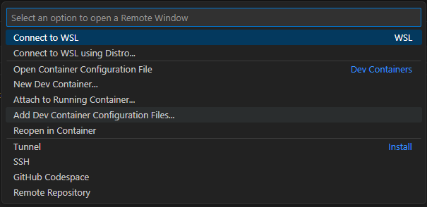
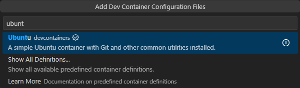
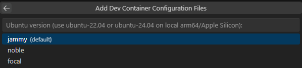
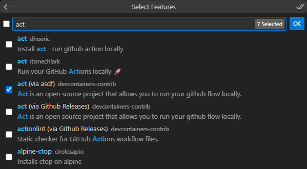
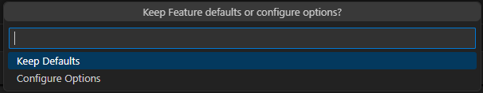
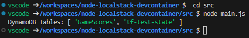
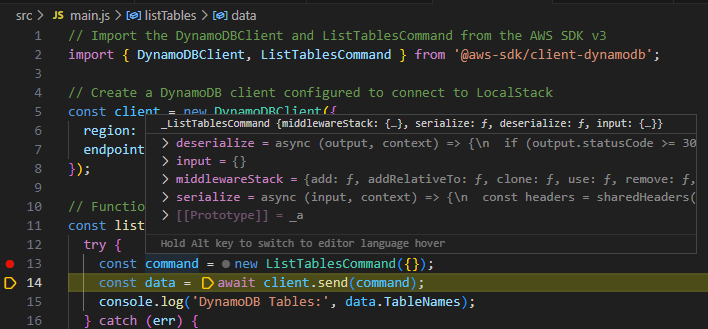

# Node PostgreSQL DevContainer Example

This repository is part of a presentation about DevContainers. Please check this [repository](https://github.com/Perdiga/making-dev-life-easier-with-devcontainers) as a starting point.

# What you will learn 

How to setup a dev environment with: 

- Node.Js
- Terraform - IaC
- LocalStack - AWS local environment
- Act - Github Actions local environment

You will be able to test from application to ci/cd. 

# Repo structure
```
├── .devcontainer.backup -> If you follow the tutorial, but it's not working you can use this working devcontainer to
├── .github -> It contains the GitHub action that deploys this project
├── terraform -> It uses terraform to provision resource on AWS
├── src -> It contains a testing code written in node.js
└── scripts -> It contains useful scripts 
```

# Setting up the devcontainer

Ensure you have `Docker`, `VSCode`, and `Dev Containers extension` installed.

Open the command palette and click `Add Dev Container Configuration Files`. This will start a wizard to create your `devcontainer.json` file.



Select `add configuration to workspace`. This will create the `devcontainer.json` inside your project allowing you to commit and share with others.


Now you need to choose the base image that your container will run. Here we will select `Ubuntu`.



Choose the Ubuntu version that you want to use. Here we will keep the default one.



Now it's time to configure the features that we want to have installed in our container. 
This sample uses the following features:

- AWS CLI 
- Terraform (via asdf)
- Docker (Docker-outside-of-docker)
- Localstack
- Node.js (via asdf)
- Python
- Act (via asdf)




Now you can configure the features. As this sample does not require any changes you can click on `Keep Defaults`



Done! Now you should have a `.devcontainer` folder in your project. 

Before running our container, we need to make some changes. 

First, we will forward a port that is used by Localstack, this will ensure that you can connect the Localstack Desktop app to the container. To do this add the following line to the `devcontainer.json`

```
// Use 'forwardPorts' to make a list of ports inside the container available locally.
"forwardPorts": [4566],
```

We also want to customize our vscode environment by adding extensions and defining bash as the default shell. You can do this customization by adding the following lines to the `devcontainer.json`

```
// Configure tool-specific properties.
"customizations": {
 "extensions": [
 "ms-vscode-remote.remote-containers"
 ],
 "vscode": {
 "settings": {
 "terminal.integrated.shell.linux": "/bin/bash",
 },
 "extensions": [
 "hashicorp.terraform",
 "4ops.terraform",
 "dbaeumer.vscode-eslint"
 ]
 }
},
```

The last change we need to do is configure the container to run a custom script after the container is created. You can do this by adding the following lines to the `devcontainer.json`

```
// Use 'postCreateCommand' to run commands after creating the container.
"postCreateCommand": "bash scripts/postCreateCommand.sh",
```

This script, which you can find in `script` folder, will make sure that the Localstack is clean, the aws is configured and the project is ready to be executed

So every time that the container is created it will run this script finishing the container preparation.

Now you can start your container. You can open the `Command Palette` and click on `Reopen in Container`


After a few moments, your container will be available and ready to use. 

# Using this container

## Running your application locally
To run this application you can run `node main.js` on the `src` folder. 



You can also debug normally by pressing `F5` on the `main.js` file.



## Running your CI/CD locally
You can test your entire CI/CD locally using the Act tool. This tool executes a Github Action locally. This repository contains a workflow that can be executed by running the following command. 

- `act -j test` - run the job with the name test
- `act` - run the the entire pipeline
- `act -l` - view the execution graph

In the first execution, you will need to define the image that will be used. I recommend using the `Medium`.

On this project, we have a sample workflow that deploys the infrastructure using Terraform, builds the app, and runs the lint and tests. 

## Accessing the local AWS
You can check the AWS local resources using the `AWS CLI` or download the LocalStack Desktop. Localstack has a community license that allows you to simulate some AWS resources but for some resources, you will need a pro license.

